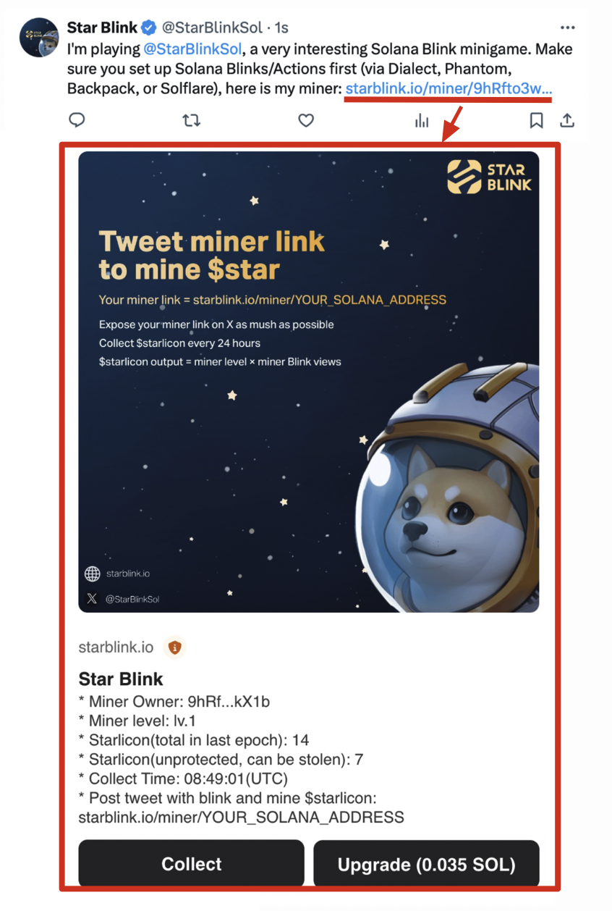

# 🎮 How to play

<figure><figcaption></figcaption></figure>

# Table of contents

* [🎮 How to play](README.md)
  * [🛠️ Set up](how-to-play/set-up.md)
  * [🌟 Starlicon](how-to-play/starlicon.md)
  * [💪 Upgrade](how-to-play/upgrade.md)
  * [💰 Collect](how-to-play/collect.md)
  * [🪐 Decentralized Game](how-to-play/decentralized-game.md)
  * [💲 Tokenomics](how-to-play/tokenomics.md)

## Quick Start

⚠️ You need to enable **Solana Actions/Blinks** first to play the game. Don't know how to set up?  [Check here](how-to-play/set-up.md). If you want to learn more about Solana Actions/Blinks, [Check here](https://docs.dialect.to/documentation).

1. Get your miner, it’s free. Your miner link = **starblink.io/miner/YOUR\_SOLANA\_ADDRESS.**
2. Post your miner link in your tweets to start mining.
3. The amount of $starlicon produced in each epoch (24 hours) = **miner level \* miner Blink views**.
4. The more **Solana Blink users** who view your tweets containing the miner link, the higher your miner Blink views will be.
5. You can not only upgrade your own miner but also upgrade someone else's miner, thereby becoming a **shareholder** of someone's miner.
6. Each miner has a different epoch start time or **collect time**. You can only collect $starlicon after the collect time.
7. You can collect $starlicon from your own miner or from the miner where you are a shareholder, meanwhile **you can also "steal" $starlicon from other miners**.
8. To either upgrade or collect from other miners, **you need to find their miners' Blink on X/Twitter**. There is no centralized website to perform all operations, which is a key aspect of the game’s design.
9. **This game would not be possible without the technology provided by Solana Blink. LFG!!!**

<figure><figcaption>
Post your miner link in your tweets to start mining
</figcaption></figure>
